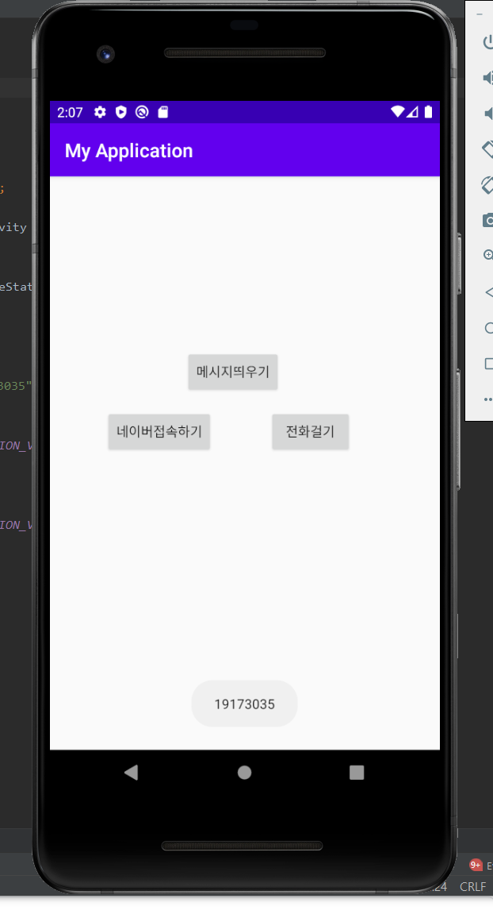

# 19173035최다영

## 2주차 과제
</img>
    
## 3주차 과제
</img>
</img>
</img>
    
## 4주차 과제
아이디어 명 : 지하철의 실시간 위치 안내 앱
- 바쁜 출근길에 지하철이 제 시간보다 빨리오거나 늦게오는 경우를 대비 가능
- 지하철의 시간표와 실시간 위치를 같이 보여주어 출근길 대비 가능
- 지하철 사고 등으로 지연시, 사고명과 위치를 알려주어 편리함 증가
-출발지 / 목적지 설정을 예상 도착 시간 도출 가능

## 7 주차 과제
</img>
</img>

## 9 주차 과제
</img>
</img>
</img>
</img>
</img>
</img>

## 10 주차 과제
</img>

## 11 주차 과제
</img>
</img>
</img>

## 12 주차 과제
</img>
</img>

